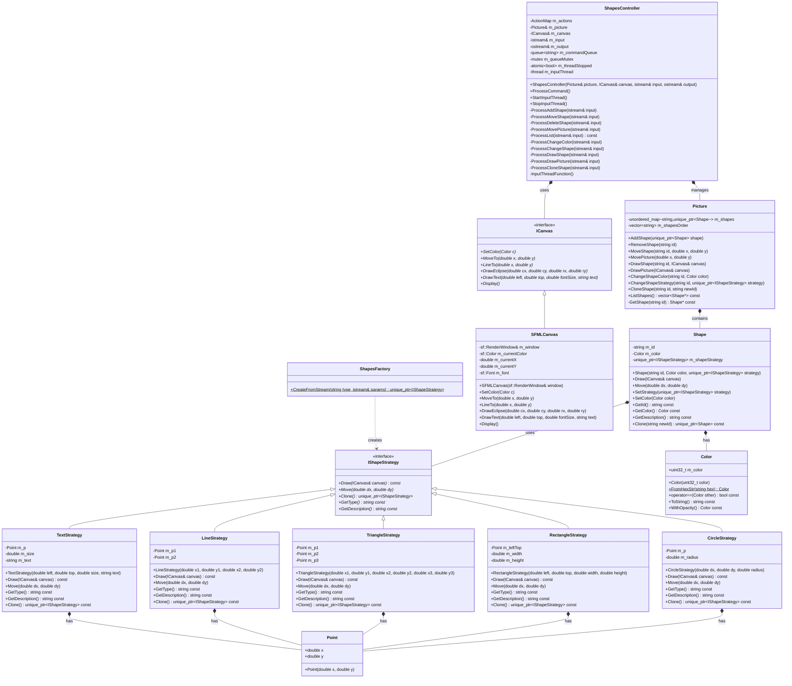

# Диаграмма классов

```mermaid
classDiagram
    %% Core interfaces
    class ICanvas {
        <<interface>>
        +SetColor(Color c)*
        +MoveTo(double x, double y)*
        +LineTo(double x, double y)*
        +DrawEclipse(double cx, double cy, double rx, double ry)*
        +DrawText(double left, double top, double fontSize, string text)*
        +Display()*
    }

    class IShapeStrategy {
        <<interface>>
        +Draw(ICanvas& canvas)* const
        +Move(double dx, double dy)*
        +Clone()* unique_ptr~IShapeStrategy~
        +GetType()* string const
        +GetDescription()* string const
    }

    %% Data structures
    class Point {
        +double x
        +double y
        +Point(double x, double y)
    }

    class Color {
        +uint32_t m_color
        +Color(uint32_t color)
        +FromHexStr(string hex)$ Color
        +operator==(Color other) bool const
        +ToString() string const
        +WithOpacity() Color const
    }

    %% Core classes
    class Shape {
        -string m_id
        -Color m_color
        -unique_ptr~IShapeStrategy~ m_shapeStrategy
        +Shape(string id, Color color, unique_ptr~IShapeStrategy~ strategy)
        +Draw(ICanvas& canvas)
        +Move(double dx, double dy)
        +SetStrategy(unique_ptr~IShapeStrategy~ strategy)
        +SetColor(Color color)
        +GetId() string const
        +GetColor() Color const
        +GetDescription() string const
        +Clone(string newId) unique_ptr~Shape~ const
    }

    class Picture {
        -unordered_map~string,unique_ptr~Shape~~ m_shapes
        -vector~string~ m_shapesOrder
        +AddShape(unique_ptr~Shape~ shape)
        +RemoveShape(string id)
        +MoveShape(string id, double x, double y)
        +MovePicture(double x, double y)
        +DrawShape(string id, ICanvas& canvas)
        +DrawPicture(ICanvas& canvas)
        +ChangeShapeColor(string id, Color color)
        +ChangeShapeStrategy(string id, unique_ptr~IShapeStrategy~ strategy)
        +CloneShape(string id, string newId)
        +ListShapes() vector~Shape*~ const
        -GetShape(string id) Shape* const
    }

    %% Strategy implementations
    class CircleStrategy {
        -Point m_p
        -double m_radius
        +CircleStrategy(double dx, double dy, double radius)
        +Draw(ICanvas& canvas) const
        +Move(double dx, double dy)
        +GetType() string const
        +GetDescription() string const
        +Clone() unique_ptr~IShapeStrategy~ const
    }

    class RectangleStrategy {
        -Point m_leftTop
        -double m_width
        -double m_height
        +RectangleStrategy(double left, double top, double width, double height)
        +Draw(ICanvas& canvas) const
        +Move(double dx, double dy)
        +GetType() string const
        +GetDescription() string const
        +Clone() unique_ptr~IShapeStrategy~ const
    }

    class TriangleStrategy {
        -Point m_p1
        -Point m_p2
        -Point m_p3
        +TriangleStrategy(double x1, double y1, double x2, double y2, double x3, double y3)
        +Draw(ICanvas& canvas) const
        +Move(double dx, double dy)
        +GetType() string const
        +GetDescription() string const
        +Clone() unique_ptr~IShapeStrategy~ const
    }

    class LineStrategy {
        -Point m_p1
        -Point m_p2
        +LineStrategy(double x1, double y1, double x2, double y2)
        +Draw(ICanvas& canvas) const
        +Move(double dx, double dy)
        +GetType() string const
        +GetDescription() string const
        +Clone() unique_ptr~IShapeStrategy~ const
    }

    class TextStrategy {
        -Point m_p
        -double m_size
        -string m_text
        +TextStrategy(double left, double top, double size, string text)
        +Draw(ICanvas& canvas) const
        +Move(double dx, double dy)
        +GetType() string const
        +GetDescription() string const
        +Clone() unique_ptr~IShapeStrategy~ const
    }

    %% Canvas implementation
    class SFMLCanvas {
        -sf::RenderWindow& m_window
        -sf::Color m_currentColor
        -double m_currentX
        -double m_currentY
        -sf::Font m_font
        +SFMLCanvas(sf::RenderWindow& window)
        +SetColor(Color c)
        +MoveTo(double x, double y)
        +LineTo(double x, double y)
        +DrawEclipse(double cx, double cy, double rx, double ry)
        +DrawText(double left, double top, double fontSize, string text)
        +Display()
    }

    %% Controller and Factory
    class ShapesController {
        -ActionMap m_actions
        -Picture& m_picture
        -ICanvas& m_canvas
        -istream& m_input
        -ostream& m_output
        -queue~string~ m_commandQueue
        -mutex m_queueMutex
        -atomic~bool~ m_threadStopped
        -thread m_inputThread
        +ShapesController(Picture& picture, ICanvas& canvas, istream& input, ostream& output)
        +ProcessCommand()
        +StartInputThread()
        +StopInputThread()
        -ProcessAddShape(istream& input)
        -ProcessMoveShape(istream& input)
        -ProcessDeleteShape(istream& input)
        -ProcessMovePicture(istream& input)
        -ProcessList(istream& input) const
        -ProcessChangeColor(istream& input)
        -ProcessChangeShape(istream& input)
        -ProcessDrawShape(istream& input)
        -ProcessDrawPicture(istream& input)
        -ProcessCloneShape(istream& input)
        -InputThreadFunction()
    }

    class ShapesFactory {
        +CreateFromStream(string type, istream& params)$ unique_ptr~IShapeStrategy~
    }

    %% Relationships
    IShapeStrategy <|-- CircleStrategy
    IShapeStrategy <|-- RectangleStrategy
    IShapeStrategy <|-- TriangleStrategy
    IShapeStrategy <|-- LineStrategy
    IShapeStrategy <|-- TextStrategy

    ICanvas <|-- SFMLCanvas

    Shape *-- IShapeStrategy : uses
    Shape *-- Color : has
    Picture *-- Shape : contains
    ShapesController *-- Picture : manages
    ShapesController *-- ICanvas : uses
    ShapesFactory ..> IShapeStrategy : creates

    CircleStrategy *-- Point : has
    RectangleStrategy *-- Point : has
    TriangleStrategy *-- Point : has
    LineStrategy *-- Point : has
    TextStrategy *-- Point : has
```