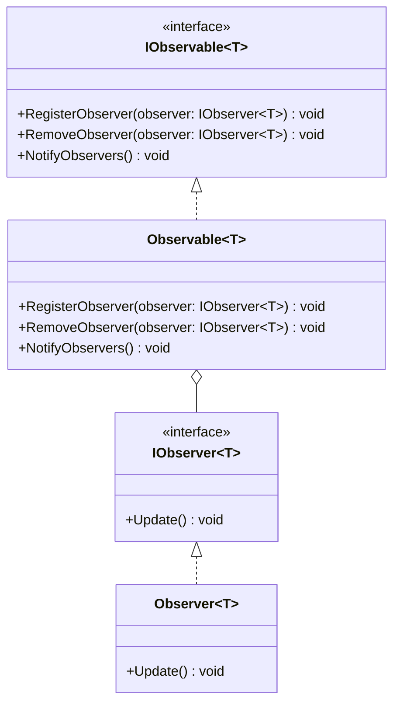

```mermaid
classDiagram
    class IObserver~T~ {
        <<interface>>
        +Update() void
    }
    
    class Observer~T~ {
        +Update() void
    }
    
    class IObservable~T~ {
        <<interface>>
        +RegisterObserver(observer: IObserver~T~) void
        +RemoveObserver(observer: IObserver~T~) void
        +NotifyObservers() void
    }

    class Observable~T~ {
        +RegisterObserver(observer: IObserver~T~) void
        +RemoveObserver(observer: IObserver~T~) void
        +NotifyObservers() void
    }

    IObservable <|.. Observable
    IObserver <|.. Observer
    Observable o-- IObserver
```