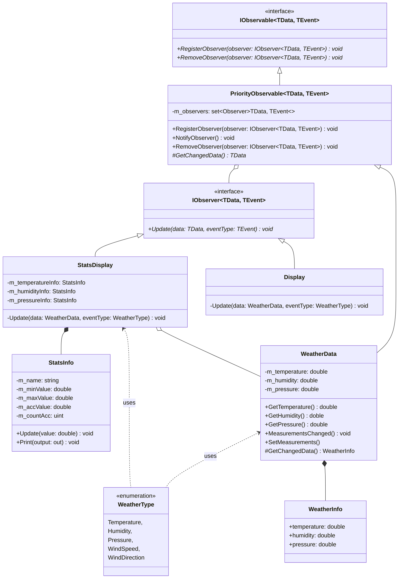

# Диаграмма классов

```mermaid
classDiagram
    class IObserver~TData, TEvent~ {
        <<interface>>
        +Update(data: TData, eventType: TEvent) void*
    }
    class IObservable~TData, TEvent~ {
        <<interface>>
        +RegisterObserver(observer: IObserver~TData, TEvent~) void*
        +RemoveObserver(observer: IObserver~TData, TEvent~) void*
    }
    class PriorityObservable~TData, TEvent~ {
        -m_observers: set~Observer~TData, TEvent~~
        +RegisterObserver(observer: IObserver~TData, TEvent~) void
        +NotifyObserver() void
        +RemoveObserver(observer: IObserver~TData, TEvent~) void
        #GetChangedData() TData*
    }
    class StatsDisplay {
        -m_temperatureInfo: StatsInfo
        -m_humidityInfo: StatsInfo
        -m_pressureInfo: StatsInfo
        -Update(data: WeatherData, eventType: WeatherType) void
    }
    class Display {
        -Update(data: WeatherData, eventType: WeatherType) void
    }
    class StatsInfo {
        -m_name: string
        -m_minValue: double
        -m_maxValue: double
        -m_accValue: double
        -m_countAcc: uint
        +Update(value: double) void
        +Print(output: out) void
    }
    class WeatherInfo {
        +temperature: double
        +humidity: double
        +pressure: double
    }
    class WeatherData {
        -m_temperature: double
        -m_humidity: double
        -m_pressure: double
        +GetTemperature() double
        +GetHumidity() doble
        +GetPressure() double
        +MeasurementsChanged() void
        +SetMeasurements()
        #GetChangedData() WeatherInfo
    }
    class WeatherType {
        <<enumeration>>
        Temperature,
        Humidity,
        Pressure,
        WindSpeed,
        WindDirection
 }

    PriorityObservable o-- IObserver
    IObserver <|-- Display
    IObserver <|-- StatsDisplay
    IObservable <|-- PriorityObservable
    StatsDisplay *-- StatsInfo
    WeatherData *-- WeatherInfo
    StatsDisplay o-- WeatherData
    PriorityObservable <|-- WeatherData
    StatsDisplay <.. WeatherType : uses
    WeatherData <.. WeatherType : uses
```