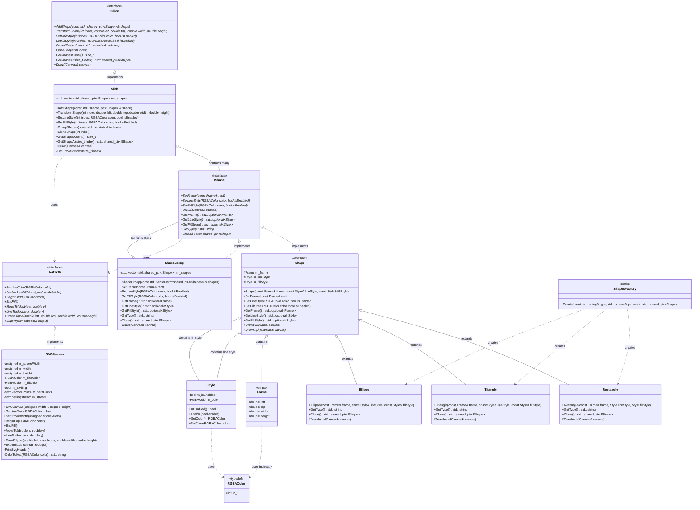

# Диаграмма классов проекта Slides

```mermaid
classDiagram
%% Базовые типы и структуры
    class RGBAColor {
        <<typedef>>
        uint32_t
    }

    class Frame {
        <<struct>>
        +double left
        +double top
        +double width
        +double height
    }

    class Style {
        -bool m_isEnabled
        -RGBAColor m_color
        +IsEnabled() bool
        +Enable(bool enable)
        +GetColor() RGBAColor
        +SetColor(RGBAColor color)
    }

%% Интерфейс ICanvas
    class ICanvas {
        <<interface>>
        +SetLineColor(RGBAColor color)*
        +SetStrokeWidth(unsigned strokeWidth)*
        +BeginFill(RGBAColor color)*
        +EndFill()*
        +MoveTo(double x, double y)*
        +LineTo(double x, double y)*
        +DrawEllipse(double left, double top, double width, double height)*
        +Export(std:: ostream& output)*
    }

%% Реализация Canvas
    class SVGCanvas {
        -unsigned m_strokeWidth
        -unsigned m_width
        -unsigned m_height
        -RGBAColor m_lineColor
        -RGBAColor m_fillColor
        -bool m_isFilling
        -std:: vector~Point~ m_pathPoints
        -std:: ostringstream m_stream
        +SVGCanvas(unsigned width, unsigned height)
        +SetLineColor(RGBAColor color)
        +SetStrokeWidth(unsigned strokeWidth)
        +BeginFill(RGBAColor color)
        +EndFill()
        +MoveTo(double x, double y)
        +LineTo(double x, double y)
        +DrawEllipse(double left, double top, double width, double height)
        +Export(std:: ostream& output)
        -PrintSvgHeader()
        -ColorToHex(RGBAColor color) std:: string
    }

%% Интерфейс IShape (паттерн Компоновщик)
    class IShape {
        <<interface>>
        +SetFrame(const Frame& rect)*
        +SetLineStyle(RGBAColor color, bool isEnabled)*
        +SetFillStyle(RGBAColor color, bool isEnabled)*
        +Draw(ICanvas& canvas)*
        +GetFrame() std:: optional~Frame~*
        +GetLineStyle() std:: optional~Style~*
        +GetFillStyle() std:: optional~Style~*
        +GetType() std:: string*
        +Clone() std:: shared_ptr~IShape~*
    }

%% Базовый класс Shape (Leaf в паттерне Компоновщик)
    class Shape {
        <<abstract>>
        #Frame m_frame
        #Style m_lineStyle
        #Style m_fillStyle
        +Shape(const Frame& frame, const Style& lineStyle, const Style& fillStyle)
        +SetFrame(const Frame& rect)
        +SetLineStyle(RGBAColor color, bool isEnabled)
        +SetFillStyle(RGBAColor color, bool isEnabled)
        +GetFrame() std:: optional~Frame~
        +GetLineStyle() std:: optional~Style~
        +GetFillStyle() std:: optional~Style~
        +Draw(ICanvas& canvas)
        #DrawImpl(ICanvas& canvas)*
    }

%% Конкретные фигуры
    class Rectangle {
        +Rectangle(const Frame& frame, Style lineStyle, Style fillStyle)
        +GetType() std:: string
        +Clone() std:: shared_ptr~IShape~
        #DrawImpl(ICanvas& canvas)
    }

    class Triangle {
        +Triangle(const Frame& frame, const Style& lineStyle, const Style& fillStyle)
        +GetType() std:: string
        +Clone() std:: shared_ptr~IShape~
        #DrawImpl(ICanvas& canvas)
    }

    class Ellipse {
        +Ellipse(const Frame& frame, const Style& lineStyle, const Style& fillStyle)
        +GetType() std:: string
        +Clone() std:: shared_ptr~IShape~
        #DrawImpl(ICanvas& canvas)
    }

%% Группа фигур (Composite в паттерне Компоновщик)
    class ShapeGroup {
        -std:: vector~std::shared_ptr~IShape~~ m_shapes
        +ShapeGroup(const std:: vector~std::shared_ptr~IShape~~ & shapes)
        +SetFrame(const Frame& rect)
        +SetLineStyle(RGBAColor color, bool isEnabled)
        +SetFillStyle(RGBAColor color, bool isEnabled)
        +GetFrame() std:: optional~Frame~
        +GetLineStyle() std:: optional~Style~
        +GetFillStyle() std:: optional~Style~
        +GetType() std:: string
        +Clone() std:: shared_ptr~IShape~
        +Draw(ICanvas& canvas)
    }

%% Интерфейс ISlide
    class ISlide {
        <<interface>>
        +AddShape(const std:: shared_ptr~IShape~ & shape)*
        +TransformShape(int index, double left, double top, double width, double height)*
        +SetLineStyle(int index, RGBAColor color, bool isEnabled)*
        +SetFillStyle(int index, RGBAColor color, bool isEnabled)*
        +GroupShapes(const std:: set~int~ & indexes)*
        +CloneShape(int index)*
        +GetShapesCount() size_t*
        +GetShapeAt(size_t index) std:: shared_ptr~IShape~*
        +Draw(ICanvas& canvas)*
    }

%% Реализация Slide
    class Slide {
        -std:: vector~std::shared_ptr~IShape~~ m_shapes
        +AddShape(const std:: shared_ptr~IShape~ & shape)
        +TransformShape(int index, double left, double top, double width, double height)
        +SetLineStyle(int index, RGBAColor color, bool isEnabled)
        +SetFillStyle(int index, RGBAColor color, bool isEnabled)
        +GroupShapes(const std:: set~int~ & indexes)
        +CloneShape(int index)
        +GetShapesCount() size_t
        +GetShapeAt(size_t index) std:: shared_ptr~IShape~
        +Draw(ICanvas& canvas)
        -EnsureValidIndex(size_t index)
    }

%% Фабрика фигур
    class ShapesFactory {
        <<static>>
        +Create(const std:: string& type, std:: istream& params) std:: shared_ptr~Shape~
    }

%% Связи
    ICanvas <|.. SVGCanvas: implements
    IShape <|.. Shape: implements
    IShape <|.. ShapeGroup: implements
    Shape <|-- Rectangle: extends
    Shape <|-- Triangle: extends
    Shape <|-- Ellipse: extends
    Shape o-- Frame: contains
    Shape o-- Style: contains line style
    Shape o-- Style: contains fill style
    ShapeGroup o-- IShape: contains many
    ISlide <|.. Slide: implements
    Slide o-- IShape: contains many
    IShape ..> ICanvas: uses
    Slide ..> ICanvas: uses
    ShapesFactory ..> Rectangle: creates
    ShapesFactory ..> Triangle: creates
    ShapesFactory ..> Ellipse: creates
    Style ..> RGBAColor: uses
    Frame ..> RGBAColor: uses indirectly
```